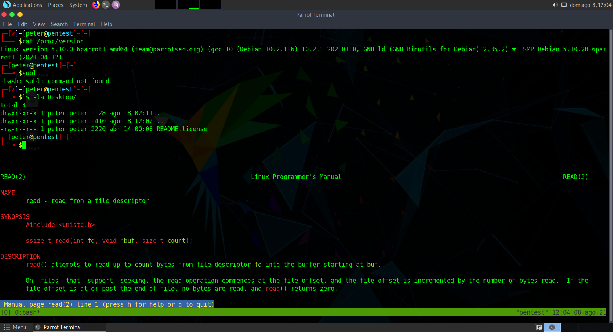
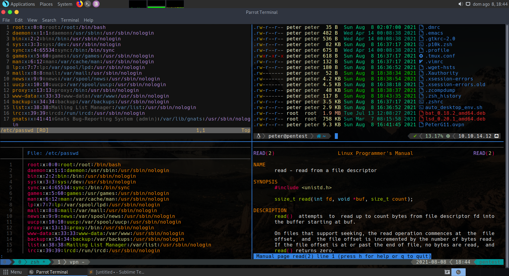

# MyDeskEnv

## Auto Desktop Environment.

- zsh
	- auto-suggestions
	- syntax-highlight
	- sudo-plugin
- PowerLeve10K
- vim
- tmux (Install theme with Ctrl+a, i.e. the prefix, and then I)
- batcat
- lsd
- HackNerd font

# Before

# After

# Demo
[https://youtu.be/mJVh5KTqZA0](https://youtu.be/mJVh5KTqZA0)